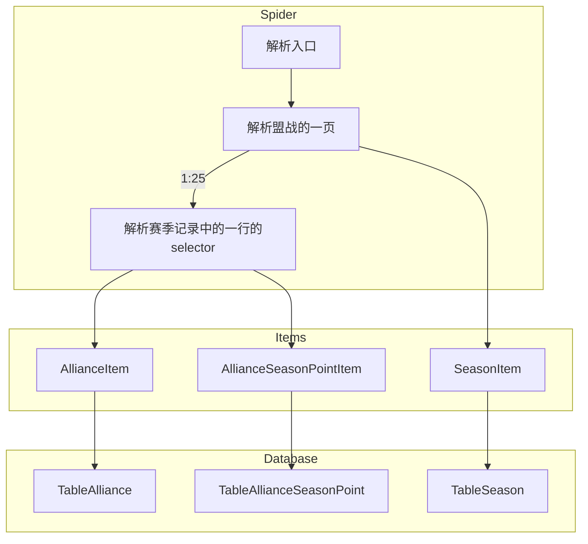

# 爬虫设计

本文档描述了爬虫`gunsupgame`的结构。

## 设计

```mermaid

graph TD
    subgraph Spider
        parse[解析入口]
        parse_season_page[解析盟战的一页]
        parse_season_line[解析赛季记录中的一行的selector]

        parse --> parse_season_page
        parse_season_page --1:25--> parse_season_line
    end

    subgraph Items
        AllianceItem
        SeasonItem
        AllianceSeasonPointItem
    end

    subgraph Database
        TableAlliance
        TableSeason
        TableAllianceSeasonPoint
    end

    parse_season_page --> SeasonItem
    parse_season_line --> AllianceItem
    parse_season_line --> AllianceSeasonPointItem

    AllianceItem --> TableAlliance
    SeasonItem --> TableSeason
    AllianceSeasonPointItem --> TableAllianceSeasonPoint
```